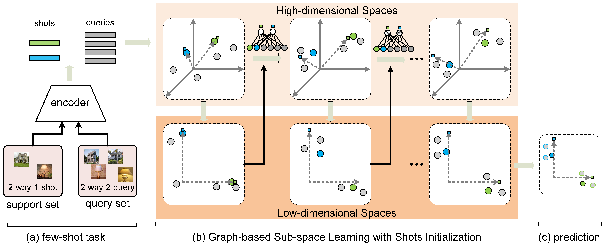

# [ICME2021 Oral] GSS: Graph-based Subspace Learning with Shots Initialization for Few-shot Recognition



TO RUN:

1. set your GPU in and dataset path in ''run.sh''
2. run ''./run.sh''

## Citation
```
@inproceedings{
wang2021gss,
title={GSS: Graph-based Subspace Learning with Shots Initialization for Few-shot Recognition},
author={Rui-Qi, wang and Xu-Yao, Zhang and Cheng-Lin, Liu},
booktitle={International Conference on Multimedia and Expo},
year={2021}
}
```
## Reference

<https://github.com/megvii-research/DPGN>